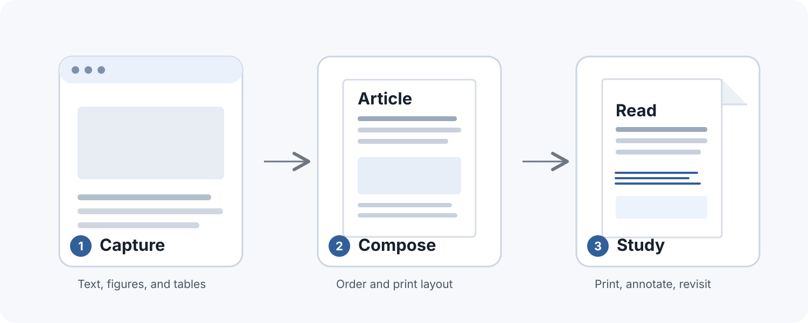

## Abstract

The web makes it easy to find an article and just as easy to leave it half-read. A printed copy changes the pace: the page stays still, the margins are yours, and a figure can sit beside the paragraph that explains it. This short design note describes a simple path from an online article to a paper copy. It is an original demonstration, not a report of an experiment.

## Give the article a stable page

An article on a screen is surrounded by browser controls, changing sidebars, and links asking for attention. A paper copy gathers the words into one sequence. You can carry that sequence away from the device, underline a sentence, or add a question beside a chart.

The aim is not to make every web page look like a journal. A useful print copy keeps the author’s order and wording, gives wide figures room to breathe, and leaves enough contrast for labels to survive an ordinary printer. The result should feel like the same article, made easier to stay with.



## Keep the parts that carry meaning

The page around an article may disappear when it is printed; the article’s structure should remain. Headings guide the reader through the argument. A table keeps its row and column relationships. A chart keeps its labels near the marks they describe. Code should remain readable as an example rather than being executed during document generation.

| Article element | Useful print treatment |
| --- | --- |
| Paragraphs and headings | Preserve the source order and wording |
| Wide chart or table | Give it a landscape Letter page when needed |
| Source image | Capture at enough pixels for its printed size |
| Code sample | Keep as inert, selectable text |

That is a practical standard rather than a claim that paper always helps every reader. The copy is valuable when its layout removes friction without quietly rewriting the source.

## A small repeatable workflow

For a local Markdown article, the command stays intentionally plain:

```sh
node bin/archive-article.mjs archive article.md --output ./paper-copy
node bin/archive-article.mjs verify ./paper-copy
```

The first command creates an editable Quarto document, the PDF, and a source bundle. The second checks the paper size, source text witnesses, and image resolution. A person still needs to inspect every page at print size before treating the result as finished.

## Closing note

Some writing is worth taking off the screen. A stable page makes room to read at your own pace, return to a thought, and leave yourself a mark for next time. The best print copy keeps the article recognizable while giving the reader a little more space to think.

This demonstration uses original prose and a schematic diagram. It includes no measured results or outside research claims.
