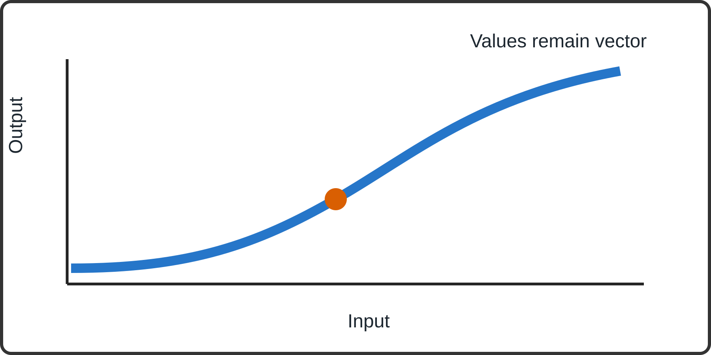

# A Compact Article With Math and Code

The measurement is defined by $f(x) = x^2 + 1$ and the slope is $f'(x) = 2x$.[^1]

| Trial | Input | Output |
|:--|--:|--:|
| First | 2 | 5 |
| Second | 3 | 10 |



The results table and figure retain each label and value.

```{r}
writeLines("This source example must stay inert.", "should-not-exist.txt")
```

[^1]: The complete source footnote belongs at the end of the article.
